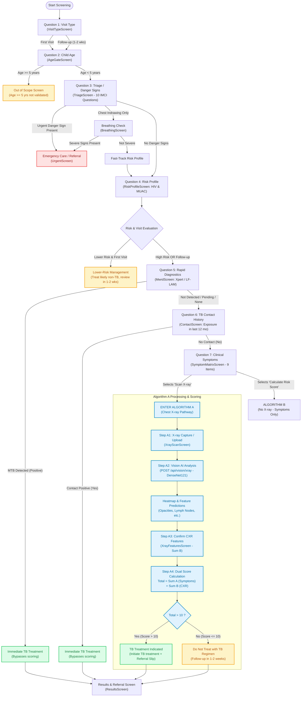
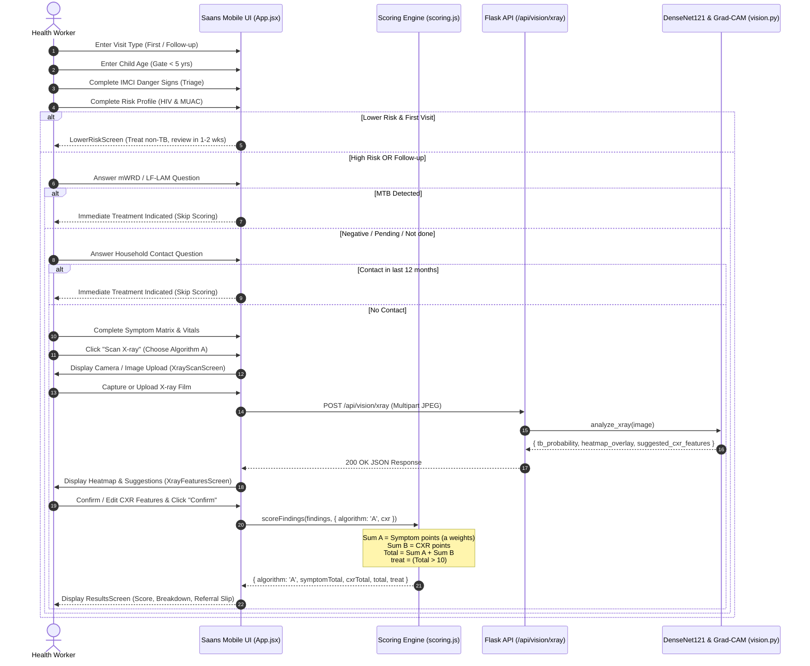

# Algorithm A: Paediatric TB Clinical Assessment & Scoring Flow

> **Clinical Reference**: WHO Operational Handbook on Tuberculosis, Module 5 (2022), Annex 5.  
> **Implementation**: `Saans` Paediatric TB Screening Application.

---

## 1. High-Level Decision Flowchart

This flowchart outlines the complete path a healthcare worker takes through the questionnaire screens to reach **Algorithm A** (Chest X-ray available) and the final treatment decision.

---

## 2. Step-by-Step Breakdown of Questions Leading to Algorithm A

The application guides the healthcare worker through a strict sequence of safety-first clinical filters before reaching symptom and radiological scoring.

### Question 1: Visit Type
- **Screen**: [`VisitTypeScreen.jsx`](file:///d:/Ai%20agents%20Projects/Saans/src/screens/VisitTypeScreen.jsx)
- **Question**: *"Is this a first visit or a follow-up?"*
- **Options**:
  1. `first`: First visit
  2. `followUp`: Follow-up after 1–2 weeks (symptoms persisted or worsened)
- **Clinical Role**: Protects against over-treating children with common self-limiting non-TB respiratory illnesses on their first presentation.

---

### Question 2: Age Gate
- **Screen**: [`AgeGateScreen.jsx`](file:///d:/Ai%20agents%20Projects/Saans/src/screens/AgeGateScreen.jsx)
- **Question**: *"How old is the child?"* (Input in completed years, `0` to `17`)
- **Validation**:
  - `age < 5`: Validated target population for the Saans screening tool. Proceed to IMCI Triage.
  - `age >= 5`: Navigates to [`OutOfScopeScreen.jsx`](file:///d:/Ai%20agents%20Projects/Saans/src/screens/OutOfScopeScreen.jsx).

---

### Question 3: Emergency IMCI Danger Signs (Triage)
- **Screen**: [`TriageScreen.jsx`](file:///d:/Ai%20agents%20Projects/Saans/src/screens/TriageScreen.jsx)
- **Definition**: [`dangerSigns.js`](file:///d:/Ai%20agents%20Projects/Saans/src/data/dangerSigns.js)
- **Questions Asked Sequentially**:
  1. *"Can the child drink or breastfeed?"* (Trigger on **NO**)
  2. *"Does the child vomit everything they eat or drink?"* (Trigger on **YES**)
  3. *"Has the child had a seizure or fit?"* (Trigger on **YES**)
  4. *"Is the child very sleepy, difficult to wake, or unconscious?"* (Trigger on **YES**)
  5. *"Does the child's chest pull in deeply when breathing?"* (Chest indrawing $\rightarrow$ triggers **Breathing check**)
  6. *"Does the child make a loud, harsh noise while breathing calmly?"* (Stridor $\rightarrow$ **Urgent**)
  7. *"Signs of severe dehydration (sunken eyes, skin pinch returns very slowly)?"* (Trigger on **YES**)
  8. *"Severe palmar pallor?"* (Trigger on **YES**)
  9. *"Oxygen saturation below 90% (if pulse oximeter available)?"* (Trigger on **YES**)
  10. *"Neck stiffness or bulging fontanelle?"* (Trigger on **YES**)
- **Outcomes**:
  - **Any Urgent Sign**: Immediate diversion to [`UrgentScreen.jsx`](file:///d:/Ai%20agents%20Projects/Saans/src/screens/UrgentScreen.jsx) for emergency stabilization.
  - **Chest Indrawing Only**: Diverts to [`BreathingScreen.jsx`](file:///d:/Ai%20agents%20Projects/Saans/src/screens/BreathingScreen.jsx) to evaluate severity; if non-severe, sets `fastTrack = true`.
  - **All Clear**: Proceeds to Risk Profile.

---

### Question 4: Risk Profile (Vulnerability Stratification)
- **Screen**: [`RiskProfileScreen.jsx`](file:///d:/Ai%20agents%20Projects/Saans/src/screens/RiskProfileScreen.jsx)
- **Questions**:
  1. *"Is the child known to be HIV positive?"* (`Yes` / `No`)
  2. *"What colour does the MUAC tape show?"*
     - `Red`: Severe acute malnutrition ($< 115\text{ mm}$)
     - `Yellow`: Moderate acute malnutrition
     - `Green`: Normal
- **High-Risk Determination**:
  The child is classified as **High Risk** if:
  $$\text{age} < 2\text{ years} \quad\lor\quad \text{HIV Positive} \quad\lor\quad \text{MUAC} = \text{Red} \quad\lor\quad \text{fastTrack} = \text{true}$$
- **Routing Gate**:
  - If **Lower Risk** AND **First Visit**: Diverts to [`LowerRiskScreen.jsx`](file:///d:/Ai%20agents%20Projects/Saans/src/screens/LowerRiskScreen.jsx) (treat non-TB cause, re-evaluate in 1–2 weeks).
  - If **High Risk** OR **Follow-up Visit**: Child proceeds directly to rapid diagnostic testing.

---

### Question 5: Rapid Diagnostic Testing (mWRD / LF-LAM)
- **Screen**: [`MwrdScreen.jsx`](file:///d:/Ai%20agents%20Projects/Saans/src/screens/MwrdScreen.jsx)
- **Question**: *"Was an mWRD (Xpert MTB/RIF or Ultra) or urine LF-LAM test performed?"*
- **Options**:
  - `Yes — MTB detected`: **Bypasses all scoring!** Direct treatment indication per WHO guidelines.
  - `Yes — not detected` / `Result not yet available` / `Not performed`: Proceeds to Contact history.

---

### Question 6: Household Contact History
- **Screen**: [`ContactScreen.jsx`](file:///d:/Ai%20agents%20Projects/Saans/src/screens/ContactScreen.jsx)
- **Question**: *"Close or household TB contact in the previous 12 months?"* (`YES` / `NO`)
- **Outcomes**:
  - **YES**: **Bypasses all scoring!** Contact history alone indicates treatment in symptomatic vulnerable children.
  - **NO**: Advances to the clinical symptom scoring matrix.

---

### Question 7: Symptom Matrix & Vitals
- **Screen**: [`SymptomMatrixScreen.jsx`](file:///d:/Ai%20agents%20Projects/Saans/src/screens/SymptomMatrixScreen.jsx)
- **9 Clinical Parameters Evaluated**:
  1. **Cough duration**: Slider 0–30 days (Qualifies at $\ge 14$ days)
  2. **Fever duration**: Slider 0–30 days (Qualifies at $\ge 14$ days)
  3. **Lethargy**: *"Persistent unexplained lethargy or reduced playfulness?"*
  4. **Weight Loss**: *"Weight loss or failure to thrive?"*
  5. **Haemoptysis**: *"Haemoptysis (coughing up blood)?"*
  6. **Night Sweats**: *"Night sweats?"*
  7. **Swollen Lymph Nodes**: *"Painless, enlarged (swollen) lymph nodes?"*
  8. **Respiratory Rate**: Auto-computes tachypnoea based on age bands:
     - $<1\text{ yr}$: $>50\text{ breaths/min}$
     - $1\text{–}5\text{ yrs}$: $>40\text{ breaths/min}$
     - $>5\text{ yrs}$: $>30\text{ breaths/min}$
  9. **Heart Rate**: Auto-computes tachycardia based on age bands:
     - $<1\text{ yr}$: $>150\text{ bpm}$
     - $1\text{–}5\text{ yrs}$: $>140\text{ bpm}$
     - $>5\text{ yrs}$: $>120\text{ bpm}$

At this screen, the user chooses between:
- **"Calculate Risk Score"** $\rightarrow$ Triggers **Algorithm B** (no X-ray).
- **"Scan X-ray"** $\rightarrow$ Enters **Algorithm A**.

---

### Question 8: Chest X-ray Features Confirmation (Algorithm A Only)
- **Screens**:
  1. [`XrayScanScreen.jsx`](file:///d:/Ai%20agents%20Projects/Saans/src/screens/XrayScanScreen.jsx): Camera capture or file upload $\rightarrow$ backend AI inference via [`POST /api/vision/xray`](file:///d:/Ai%20agents%20Projects/Saans/server/vision.py).
  2. [`XrayFeaturesScreen.jsx`](file:///d:/Ai%20agents%20Projects/Saans/src/screens/XrayFeaturesScreen.jsx): The AI pre-selects suggested features and displays a Grad-CAM heatmap.
- **Question**: *"Confirm chest X-ray features"* (The health worker confirms or edits):
  - [ ] **Cavity** (+6 points)
  - [ ] **Enlarged lymph nodes** (+17 points)
  - [ ] **Opacities** (+5 points)
  - [ ] **Miliary pattern** (+15 points)
  - [ ] **Effusion** (+8 points)

---

## 3. Algorithm A Scoring System & Mathematical Model

In Algorithm A, the overall decision score is calculated from two additive components:
$$\text{Total Score} = \text{Sum A (Symptoms)} + \text{Sum B (Chest X-ray)}$$

$$\text{Decision} = \begin{cases} 
\text{Initiate TB Treatment}, & \text{if Total Score} > 10 \\
\text{Do Not Treat; Follow-up in 1–2 weeks}, & \text{if Total Score} \le 10 
\end{cases}$$

### Scoring Comparison Table: Algorithm A vs Algorithm B

| Symptom / Feature | Criteria | Algorithm A Weight | Algorithm B Weight | Clinical Notes |
| :--- | :--- | :---: | :---: | :--- |
| **Cough $\ge 2$ weeks** | Slider $\ge 14$ days | **+2** | +5 | Baseline chronic pulmonary symptom |
| **Fever $\ge 2$ weeks** | Slider $\ge 14$ days | **+5** | +10 | Prolonged unexplained fever |
| **Lethargy** | Boolean toggle | **+3** | +4 | Reduced activity / playfulness |
| **Weight loss / failure to thrive** | Boolean toggle | **+3** | +5 | Unintentional loss or faltering growth |
| **Haemoptysis** | Boolean toggle | **+4** | +9 | Coughing blood (highly specific) |
| **Night sweats** | Boolean toggle | **+2** | +6 | Drenching night sweats |
| **Swollen lymph nodes** | Cervical, axillary, submandibular | **+4** | +7 | Painless, non-tender adenopathy |
| **Tachycardia** | Exceeds age-adjusted threshold | **+2** | +4 | Resting heart rate elevation |
| **Tachypnoea** | Exceeds age-adjusted threshold | **-1** | +2 | **Negative weight in Algorithm A!** In the presence of X-ray, tachypnoea without specific TB lesions suggests acute bacterial/viral pneumonia rather than TB. |
| **Sum A Range** | *All symptoms present* | **-1 to +24** | 0 to +52 | Re-weighted to balance CXR evidence |
| **CXR: Cavity** | Radiological finding | **+6** | N/A | Characteristic TB cavitation |
| **CXR: Enlarged lymph nodes** | Mediastinal / hilar adenopathy | **+17** | N/A | **Decisive finding**: Alone exceeds threshold ($17 > 10$) |
| **CXR: Opacities** | Consolidation / infiltration | **+5** | N/A | Parenchymal lung involvement |
| **CXR: Miliary pattern** | Diffuse micronodular spread | **+15** | N/A | **Decisive finding**: Alone exceeds threshold ($15 > 10$) |
| **CXR: Effusion** | Pleural fluid collection | **+8** | N/A | Extrapulmonary / pleural TB |
| **Sum B Range** | *All CXR features present* | **0 to +51** | N/A | Sum of confirmed radiological points |

> **Key Rule**: A total score of exactly **10 does NOT treat**. The total score must be **strictly greater than 10** (`total > 10`).

---

## 4. End-to-End System Sequence Diagram

---

## 5. Source Code References

- **Algorithm & Weights Definition**: [`src/data/scoring.js`](file:///d:/Ai%20agents%20Projects/Saans/src/data/scoring.js)
- **Triage & Danger Signs**: [`src/data/dangerSigns.js`](file:///d:/Ai%20agents%20Projects/Saans/src/data/dangerSigns.js)
- **Age-Adjusted Vital Signs**: [`src/data/vitals.js`](file:///d:/Ai%20agents%20Projects/Saans/src/data/vitals.js)
- **Main Workflow Controller**: [`src/App.jsx`](file:///d:/Ai%20agents%20Projects/Saans/src/App.jsx)
- **Symptom Collection Screen**: [`src/screens/SymptomMatrixScreen.jsx`](file:///d:/Ai%20agents%20Projects/Saans/src/screens/SymptomMatrixScreen.jsx)
- **X-ray Capture Screen**: [`src/screens/XrayScanScreen.jsx`](file:///d:/Ai%20agents%20Projects/Saans/src/screens/XrayScanScreen.jsx)
- **CXR Feature Confirmation Screen**: [`src/screens/XrayFeaturesScreen.jsx`](file:///d:/Ai%20agents%20Projects/Saans/src/screens/XrayFeaturesScreen.jsx)
- **Results & Referral Screen**: [`src/screens/ResultsScreen.jsx`](file:///d:/Ai%20agents%20Projects/Saans/src/screens/ResultsScreen.jsx)
- **Vision Model & Grad-CAM Service**: [`server/vision.py`](file:///d:/Ai%20agents%20Projects/Saans/server/vision.py)
